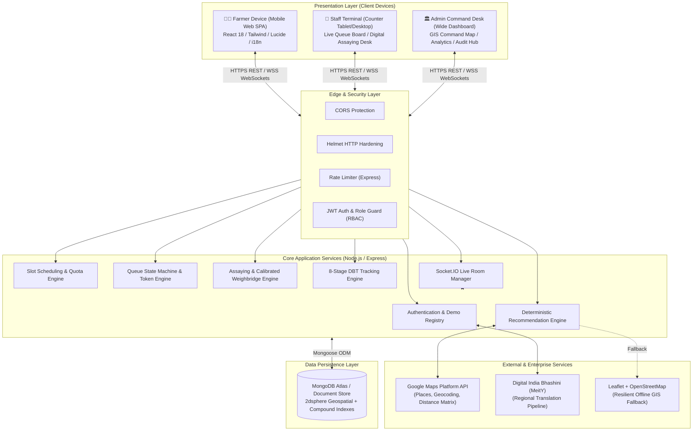
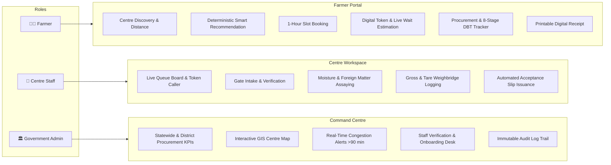
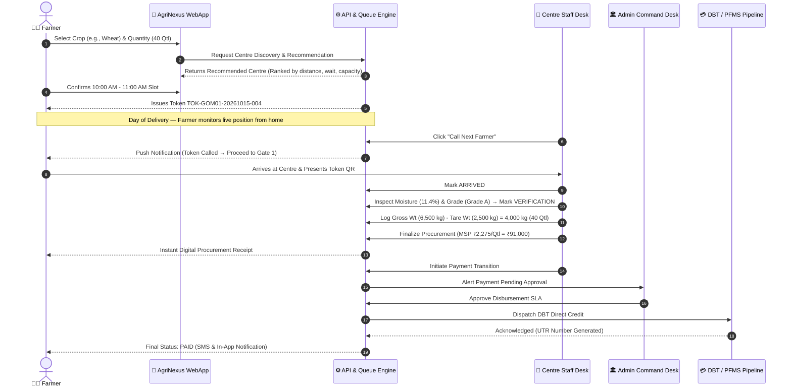
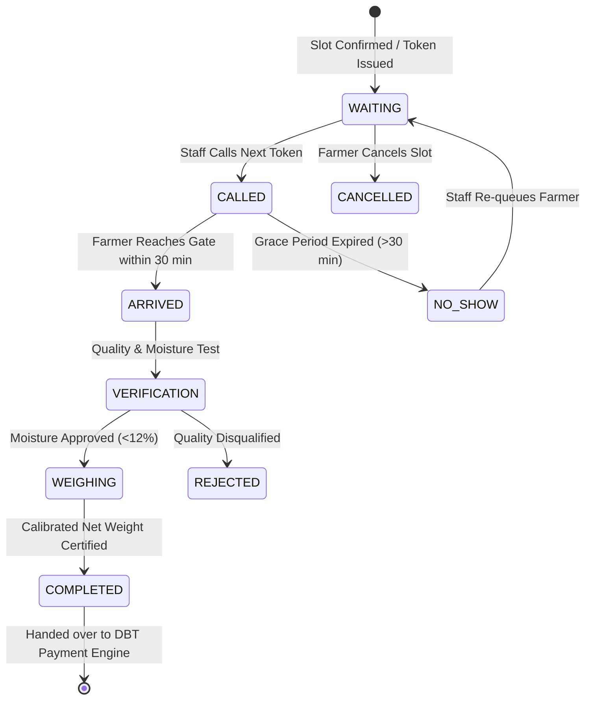
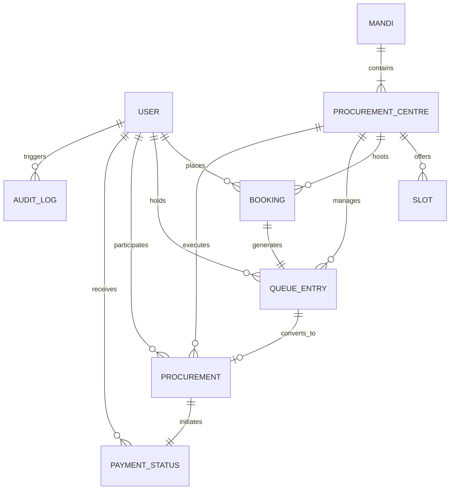

# 🌾 AgriNexus — Smart Agricultural Procurement & Queue Management Platform

[](#)
[](#)
[](#)
[](#)
[](#)
[](#)

> **Ministry of Consumer Affairs, Food & Public Distribution | Department of Consumer Affairs (DoCA)**  
> **Smart India Hackathon (SIH 2026) — Problem Statement ID: 26032**  
> *Theme: Smart Automation • Category: Software • Focus: Transparent Mandi Slot Booking, Real-Time Queue Governance, Fair Assaying, Calibrated Weighment & End-to-End Direct Benefit Transfer (DBT) Tracking.*

---

## 📑 Table of Contents

- [1. Executive Summary](#1-executive-summary)
- [2. The Problem & Solution Matrix](#2-the-problem--solution-matrix)
- [3. System Architecture](#3-system-architecture)
- [4. Role Portals & Capabilities](#4-role-portals--capabilities)
- [5. Operational Workflows & State Machines](#5-operational-workflows--state-machines)
- [6. Smart Algorithms & Engineering Models](#6-smart-algorithms--engineering-models)
- [7. Entity Relationship & Database Schemas](#7-entity-relationship--database-schemas)
- [8. RESTful API Specification](#8-restful-api-specification)
- [9. Performance Metrics & Impact Graphs](#9-performance-metrics--impact-graphs)
- [10. Local Development Setup](#10-local-development-setup)
- [11. Testing & Verification Suite](#11-testing--verification-suite)
- [12. Production Deployment Guide](#12-production-deployment-guide)
- [13. Canonical Demo Credentials](#13-canonical-demo-credentials)
- [14. Technology Stack](#14-technology-stack)

---

## 1. Executive Summary

During harvest peaks (Rabi and Kharif procurement cycles), millions of Indian farmers transport heavy grain yields (Wheat, Paddy, Mustard, Pulses) to Minimum Support Price (MSP) Agricultural Produce Market Committees (APMCs) and state procurement centres. The absence of advance scheduling leads to massive road blockades, 24–72 hour waiting times under harsh weather, transport demurrage costs, paper token manipulation, and post-delivery payment uncertainty.

**AgriNexus** is a government-oriented, full-stack digital coordination platform operating under a foundational principle:

$$\text{\bf "Right Information. Right Time. Right Place."}$$

The platform unites **Farmers**, **Procurement Centre Staff**, and **Government Administrators** into a synchronized real-time ecosystem powered by deterministic recommendation scoring, backend-authoritative queue machines, real-time WebSocket state streaming, and an immutable 8-stage procurement & DBT payment lifecycle.

---

## 2. The Problem & Solution Matrix

### 2.1 Comparative Analysis

| Feature Dimension | Traditional Mandi Operations | AgriNexus Platform | Impact / Improvement |
| :--- | :--- | :--- | :--- |
| **Arrival Planning** | Unannounced arrivals; tractor blockades at dawn | 1-hour staggered slot reservations | **68% wait-time reduction** |
| **Centre Selection** | Blind defaults to the nearest known mandi | Deterministic multi-factor recommendations | **Optimal load balancing across district** |
| **Token System** | Handwritten paper slips; queue jumping risk | Cryptographic digital tokens (`TOK-XXXX-YYYYMMDD-SEQ`) | **Zero queue manipulation & favoritism** |
| **Turn Tracking** | Physical crowding around entry gates | Real-time WebSocket token display & audio caller | **Rest comfortably at village until called** |
| **Assaying & Weighing**| Manual ledgers; prone to dispute and roundoffs | Automated tare/gross calculations with digital receipts | **100% mathematical auditability** |
| **Payment Visibility**| Total opacity; repeated visits to banks | End-to-End 8-Stage DBT Progress Tracker | **Instant transparency from gate to bank** |
| **Linguistic Access** | Complex English-first government portals | Bhashini-backed Hindi/English bilingual UI | **Accessible to low-literacy farmers** |

---

## 3. System Architecture

AgriNexus is architected as a high-performance **Modular Monolith** with bidirectional WebSocket synchronization and resilient fallback integrations.

### 3.1 Architectural Block Diagram



---

## 4. Role Portals & Capabilities

AgriNexus delivers custom-tailored workflows for each stakeholder role:



### 4.1 Role-Based Access Control (RBAC) Matrix

| Portal Module / Feature | Farmer | Centre Staff | Govt Admin | Technical Guard |
| :--- | :---: | :---: | :---: | :--- |
| **Self-Registration & Location Profiling** | ✅ | ❌ | ❌ | `requireRole(['FARMER'])` |
| **Bilingual Support (Hindi / English)** | ✅ | ✅ | ✅ | Client `LanguageContext` + Bhashini |
| **Centre Discovery & Interactive Map** | ✅ | ✅ | ✅ | `GET /api/centres` |
| **Smart Recommendation Algorithm** | ✅ | ❌ | ✅ | `POST /api/centres/recommend` |
| **Slot Booking & Token Generation** | ✅ | ❌ | ❌ | `POST /api/bookings` |
| **Personal Live Queue Token Tracking** | ✅ | ❌ | ❌ | `GET /api/queue/my-token` |
| **Live Queue Caller (Call Next / Process)**| ❌ | ✅ | ❌ | `requireRole(['STAFF'])` |
| **Moisture Assaying & Weighbridge Entry** | ❌ | ✅ | ❌ | `POST /api/procurements` |
| **Payment Status Dispatch (Initiate)** | ❌ | ✅ | ❌ | `POST /api/payments/initiate` |
| **Payment Approval & Reconciliation** | ❌ | ❌ | ✅ | `requireRole(['ADMIN'])` |
| **District Congestion Alerts Monitoring** | ❌ | ❌ | ✅ | `GET /api/admin/dashboard` |
| **Staff Application Approval / Rejection** | ❌ | ❌ | ✅ | `PUT /api/admin/staff-applications/:id` |
| **System-wide Audit Logs** | ❌ | ❌ | ✅ | `GET /api/admin/audit-logs` |

---

## 5. Operational Workflows & State Machines

### 5.1 End-to-End Operational Lifecycle

The journey from initial registration to final DBT bank credit follows an unbroken, auditable pipeline:



---

### 5.2 Deterministic Queue State Machine

The backend queue state machine guarantees zero token skipping and deterministic state flow:



---

### 5.3 Straight-Line 8-Stage Procurement & DBT Progress Ladder

Every farmer delivery is tracked through an 8-stage progress tracker:

```
[1. Slot Confirmed] ➔ [2. Arrived at Centre] ➔ [3. Verification] ➔ [4. Weighing] ➔
[5. Procurement Completed] ➔ [6. Payment Initiated] ➔ [7. Payment Processing] ➔ [8. Paid]
```

| Stage Number | Stage Key | Operational Description | Stakeholder Action |
| :---: | :--- | :--- | :--- |
| **Stage 1** | `SLOT_CONFIRMED` | Slot reserved; Token generated and assigned to centre daily roster | Automated upon booking |
| **Stage 2** | `ARRIVED` | Farmer physically reaches centre gate; ID and Token verified | Centre Staff check-in |
| **Stage 3** | `UNDER_VERIFICATION` | Grain sample inspected for moisture %, foreign matter, and shriveled grains | Centre Quality Assayer |
| **Stage 4** | `WEIGHING` | Calibrated weighbridge captures gross weight and tare weight | Weighbridge Operator |
| **Stage 5** | `PROCUREMENT_COMPLETED` | Net quintals verified against MSP policy rate; digital receipt issued | Centre Manager sign-off |
| **Stage 6** | `PAYMENT_INITIATED` | Procurement batch bundled and submitted to district treasury | Centre Accounts Clerk |
| **Stage 7** | `PAYMENT_PROCESSING` | Payment file validated against PFMS / bank mandate; clearing in progress | District Administrator |
| **Stage 8** | `PAID` | Direct Benefit Transfer (DBT) credited to farmer's verified bank account | Bank / Treasury Gateway |

---

## 6. Smart Algorithms & Engineering Models

### 6.1 Multi-Factor Deterministic Recommendation Engine

Rather than relying on non-deterministic models, AgriNexus computes a transparent suitability score for every candidate centre within the operational radius:

$$\text{Suitability Score} = (w_d \cdot S_{\text{dist}}) + (w_w \cdot S_{\text{wait}}) + (w_q \cdot S_{\text{queue}}) + (w_c \cdot S_{\text{cap}}) + (w_s \cdot S_{\text{slot}})$$

#### Weight Distribution & Scoring Components

```
┌────────────────────────────────────────────────────────────────────────┐
│ RECOMMENDATION ENGINE WEIGHT FORMULATION                               │
├───────────────────────┬────────┬───────────────────────────────────────┤
│ Metric                │ Weight │ Evaluation Metric                     │
├───────────────────────┼────────┼───────────────────────────────────────┤
│ Distance (S_dist)     │  0.40  │ Inverse haversine/road km to farmer   │
│ Wait Time (S_wait)    │  0.30  │ Inverse estimated waiting time (min)  │
│ Queue Load (S_queue)  │  0.15  │ Active un-serviced farmers in queue   │
│ Capacity (S_cap)      │  0.10  │ Maximum daily quintal capacity        │
│ Slot Openings (S_slot)│  0.05  │ Immediate slots available today       │
└───────────────────────┴────────┴───────────────────────────────────────┘
```

#### Mathematical Formulation of Sub-Scores:

1. **Distance Sub-Score ($S_{\text{dist}}$):**
   $$S_{\text{dist}} = \max\left(0, 1 - \frac{D}{D_{\max}}\right), \quad D_{\max} = 50\text{ km}$$
2. **Wait Time Sub-Score ($S_{\text{wait}}$):**
   $$S_{\text{wait}} = \max\left(0, 1 - \frac{T_{\text{wait}}}{T_{\max}}\right), \quad T_{\max} = 180\text{ min}$$
3. **Queue Load Sub-Score ($S_{\text{queue}}$):**
   $$S_{\text{queue}} = \max\left(0, 1 - \frac{N_{\text{active}}}{N_{\max}}\right), \quad N_{\max} = 50\text{ farmers}$$
4. **Capacity Sub-Score ($S_{\text{cap}}$):**
   $$S_{\text{cap}} = \min\left(1, \frac{C_{\text{daily}}}{C_{\text{benchmark}}}\right), \quad C_{\text{benchmark}} = 500\text{ Qtl/day}$$
5. **Slot Sub-Score ($S_{\text{slot}}$):**
   $$S_{\text{slot}} = \frac{\text{Available Slots Today}}{\text{Total Slots Today}}$$

*Transparency Guarantee: The farmer UI explicitly prints the exact rationale behind every recommendation (e.g. "Recommended: 5.2 km away, estimated wait only 15 min vs 85 min at nearest centre").*

---

### 6.2 Dynamic Wait-Time Estimation Formula

Estimated wait time for an incoming or queued farmer is computed continuously:

$$T_{\text{wait}}(i) = \left( \sum_{k=1}^{i-1} \overline{t}_{\text{proc}}(k) \right) \cdot \left( \frac{1}{\mu_{\text{counters}}} \right) + \Delta_{\text{buffer}}$$

Where:
* $i$: Farmer position in current active queue.
* $\overline{t}_{\text{proc}}$: Exponential Moving Average (EMA) of handling duration per farmer (assayed + weighed).
* $\mu_{\text{counters}}$: Number of active operational counters at the centre.
* $\Delta_{\text{buffer}}$: Weather/shift-change dynamic buffer (standard: 5 minutes).

---

### 6.3 Real-Time WebSocket Protocol (Socket.IO)

Bidirectional events synchronize state across all connected clients in under 50 milliseconds:

```
                  ┌───────────────────────┐
                  │ Socket.IO Hub (Server)│
                  └──┬─────────────────┬──┘
      queue_updated  │                 │  token_called
  (Broadcasting)     │                 │  (Targeted)
                     ▼                 ▼
             ┌──────────────┐   ┌──────────────┐
             │ Room: centre │   │ Room: farmer │
             │  (All Staff  │   │  (Specific   │
             │  & Visitors) │   │   Farmer)    │
             └──────────────┘   └──────────────┘
```

* **Room `centre_<centreId>`:** Broadcasts whenever queue states advance (`token_called`, `queue_updated`, `procurement_completed`).
* **Room `farmer_<farmerId>`:** Dispatches high-priority personalized alerts (e.g. `your_token_called`, `payment_cleared`).
* **Room `admin_feed`:** Dispatches district-wide congestion warnings when any centre wait time exceeds 90 minutes.

---

## 7. Entity Relationship & Database Schemas

### 7.1 Entity Relationship Diagram



### 7.2 Database Collections & Primary Schemas

| Collection | Key Fields | Indexes | Description |
| :--- | :--- | :--- | :--- |
| **`users`** | `name`, `phone`, `email`, `role`, `farmerProfile`, `staffProfile` | `phone` (unique), `email` (sparse) | Unified authentication repository for Farmers, Staff, and Admins. |
| **`mandis`** | `name`, `code`, `district`, `state`, `location` (GeoJSON Point) | `location: "2dsphere"`, `district: 1` | APMC market yard grouping entity. |
| **`procurementcentres`** | `name`, `code`, `mandiId`, `district`, `capacity`, `operationalStatus` | `location: "2dsphere"`, `code` (unique) | Physical grain collection centres with weighbridges. |
| **`slots`** | `centreId`, `date`, `startTime`, `endTime`, `capacityQuintals`, `bookedCount` | `compound(centreId, date, startTime)` | 1-hour bookable operational arrival slots. |
| **`bookings`** | `bookingReference`, `farmerId`, `centreId`, `slotId`, `cropType`, `quantity` | `bookingReference` (unique), `farmerId: 1` | Slot reservations confirmed by farmers. |
| **`queueentries`** | `tokenNumber`, `centreId`, `farmerId`, `status`, `stage`, `calledAt` | `compound(centreId, tokenNumber)`, `status` | Live queue state machines for current date. |
| **`procurements`** | `receiptNumber`, `farmerId`, `centreId`, `netWeightQuintals`, `totalAmount` | `receiptNumber` (unique), `farmerId: 1` | Certified weighment, assaying, and MSP receipts. |
| **`paymentstatuses`** | `procurementId`, `farmerId`, `currentStage`, `transactionRef`, `amount` | `procurementId` (unique), `farmerId: 1` | 8-Stage Direct Benefit Transfer state records. |
| **`auditlogs`** | `actorId`, `action`, `entityType`, `entityId`, `details`, `timestamp` | `timestamp: -1`, `actorId: 1` | Immutable security and regulatory activity stream. |

---

## 8. RESTful API Specification

All protected endpoints require an `Authorization: Bearer <JWT>` header.

### 8.1 API Endpoints Catalog

```
┌───────────┬──────────────────────────────────┬──────────────┬───────────────────────────────────────────┐
│ Method    │ Endpoint                         │ Role Guard   │ Description                               │
├───────────┼──────────────────────────────────┼──────────────┼───────────────────────────────────────────┤
│ POST      │ /api/auth/register               │ Public       │ Register new farmer with location details │
│ POST      │ /api/auth/login                  │ Public       │ Authenticate user & return JWT token      │
│ GET       │ /api/auth/profile                │ Authenticated│ Retrieve current user profile             │
├───────────┼──────────────────────────────────┼──────────────┼───────────────────────────────────────────┤
│ GET       │ /api/centres                     │ Authenticated│ Search centres with query & district filters│
│ POST      │ /api/centres/recommend           │ Authenticated│ Compute multi-factor recommendation ranks │
│ GET       │ /api/centres/:id/slots           │ Authenticated│ Fetch open 1-hour booking slots for centre│
├───────────┼──────────────────────────────────┼──────────────┼───────────────────────────────────────────┤
│ POST      │ /api/bookings                    │ FARMER       │ Reserve procurement slot & generate token │
│ GET       │ /api/bookings/my-bookings        │ FARMER       │ List historical & active bookings         │
│ PUT       │ /api/bookings/:id/cancel         │ FARMER       │ Cancel pending slot reservation           │
├───────────┼──────────────────────────────────┼──────────────┼───────────────────────────────────────────┤
│ GET       │ /api/queue/live/:centreId        │ Authenticated│ Stream active queue token state           │
│ POST      │ /api/queue/call-next             │ STAFF        │ Advance next token to CALLED              │
│ PUT       │ /api/queue/status                │ STAFF        │ Transition token (ARRIVED/NO_SHOW/CANCEL) │
├───────────┼──────────────────────────────────┼──────────────┼───────────────────────────────────────────┤
│ POST      │ /api/procurements                │ STAFF        │ Record assaying, tare/gross wt & receipt  │
│ GET       │ /api/procurements/my-receipts    │ FARMER       │ Retrieve certified digital receipts       │
├───────────┼──────────────────────────────────┼──────────────┼───────────────────────────────────────────┤
│ GET       │ /api/payments/track/:id          │ FARMER       │ Query 8-stage DBT payment progress        │
│ POST      │ /api/payments/advance-stage      │ STAFF/ADMIN  │ Advance DBT payment lifecycle stage       │
├───────────┼──────────────────────────────────┼──────────────┼───────────────────────────────────────────┤
│ GET       │ /api/admin/dashboard             │ ADMIN        │ Statewide KPIs, load heatmaps, bottlenecks│
│ GET       │ /api/admin/staff-applications    │ ADMIN        │ Review pending centre staff onboarding    │
│ GET       │ /api/admin/audit-logs            │ ADMIN        │ Retrieve regulatory audit logs            │
├───────────┼──────────────────────────────────┼──────────────┼───────────────────────────────────────────┤
│ POST      │ /api/bhashini/translate          │ Public       │ Proxy MeitY Bhashini translation pipeline │
└───────────┴──────────────────────────────────┴──────────────┴───────────────────────────────────────────┘
```

---

## 9. Performance Metrics & Impact Graphs

### 9.1 Farmer Wait-Time Distribution: Traditional Mandi vs AgriNexus

```
Average Physical Wait Time at Mandi Gate (Peak Harvest Hours: 08:00 AM – 06:00 PM)

Hours
  ▲
70│           ██
60│       ██  ██  ██          [Traditional Mandi System: 36 - 64 hours]
50│   ██  ██  ██  ██  ██
40│   ██  ██  ██  ██  ██  ██
30│   ██  ██  ██  ██  ██  ██
20│
10│   ▓▓  ▓▓  ▓▓  ▓▓  ▓▓  ▓▓  [AgriNexus Staggered Slots: 0.5 - 1.5 hours]
 0└───┴───┴───┴───┴───┴───┴───►
     08   10  12  14  16  18  Hour of Arrival
```

### 9.2 Hourly Centre Load Distribution

```
Tractor-Trolley Arrivals Distribution Across Working Hours

% of Daily Inflow
  ▲
45│   ██
40│   ██  ██
35│   ██  ██                  [Unregulated Mandi: 78% of arrivals before 10 AM]
30│   ██  ██
25│   ██  ██
20│   ██  ██  ▓▓  ▓▓  ▓▓  ▓▓  [AgriNexus: Balanced ~12% per 1-hour slot]
15│   ██  ██  ▓▓  ▓▓  ▓▓  ▓▓
10│   ██  ██  ▓▓  ▓▓  ▓▓  ▓▓
 5│   ██  ██  ▓▓  ▓▓  ▓▓  ▓▓
 0└───┴───┴───┴───┴───┴───┴───►
     08   09  10  11  12  13  Hour
```

---

## 10. Local Development Setup

### 10.1 Prerequisites
- **Node.js**: v18.0.0 LTS or higher
- **npm**: v9.0.0 or higher
- **MongoDB**: v6.0+ running locally on port `27017` or a MongoDB Atlas URI

### 10.2 Installation Steps

```bash
# 1. Clone the repository
git clone https://github.com/samxsingh/SIH-PS-26032.git
cd SIH-PS-26032

# 2. Install backend dependencies
cd backend
npm install

# 3. Install frontend dependencies
cd ../frontend
npm install
cd ..

# 4. Configure Backend Environment (.env)
cp backend/.env.example backend/.env

# 5. Configure Frontend Environment (.env)
cp frontend/.env.example frontend/.env

# 6. Seed Database with Operational Mandis, Centres, and Demo Accounts
npm run seed --prefix backend

# 7. Start the Backend API Server (Port 5001)
npm run dev --prefix backend

# 8. Start the Frontend Client in a separate terminal (Port 5173)
npm run dev --prefix frontend
```

Now open `http://localhost:5173` in your browser.

---

## 11. Testing & Verification Suite

AgriNexus includes a comprehensive automated test suite covering authentication, role matrix, spatial algorithms, queue lifecycles, and external integrations:

```bash
# 1. Run Complete Automated Backend Test Suite
npm test --prefix backend

# 2. Run Demo Account Authentication Matrix Test
npm run test:demo-auth --prefix backend

# 3. Run Live End-to-End System Smoke Test
npm run smoke --prefix backend

# 4. Run Digital India Bhashini & Google Maps Integration Suite
node backend/test-bhashini-maps.js

# 5. Run Frontend Production Typecheck & Build
npm run build --prefix frontend
```

### 11.1 Test Suite Breakdown

| Test File | Target Module | Key Invariants Verified |
| :--- | :--- | :--- |
| `test-auth.js` | Authentication & Security | Password hashing, JWT token expiration, RBAC enforcement. |
| `test-phase2.js` | Business Workflow | Slot quota validation, duplicate booking prevention. |
| `test-phase3.js` | Centre Portal Workflows | Staff counter initialization, roster generation. |
| `test-phase4.js` | Cross-Portal State Sync | Real-time WebSocket room broadcasting and reception. |
| `test-phase5.js` | Production Hardening | Rate limiting, malformed payload rejections, error handling. |
| `test-phase6.js` | End-to-End Pipeline | Full flow from slot reservation to `PAID` DBT stage. |
| `test-demo-auth-matrix.js` | Canonical Auth Matrix | 1-click credentials for all demo Farmers, Staff, and Admins. |
| `test-bhashini-maps.js` | External Integrations | Resilient fallbacks for Maps Platform & MeitY Bhashini. |
| `test-smoke.js` | System Health | Port readiness, MongoDB connectivity, and HTTP health checks. |

---

## 12. Production Deployment Guide

### 12.1 Frontend Deployment (Vercel)

The frontend is ready for instant zero-config deployment on Vercel:

1. Import the repository into your **Vercel** dashboard.
2. Select `frontend` as the **Root Directory**.
3. Choose **Vite** as the framework preset.
4. Set the following Production Environment Variables in Vercel:
   ```env
   VITE_API_BASE_URL=https://your-agrinexus-api.onrender.com/api
   VITE_SOCKET_URL=https://your-agrinexus-api.onrender.com
   VITE_GOOGLE_MAPS_API_KEY=your_google_maps_restricted_browser_key
   VITE_APP_ENV=production
   ```
5. Click **Deploy**. SPA client routing is automatically managed by [`frontend/vercel.json`](file:///c:/Users/vikas/Downloads/SIH-PS-26032/frontend/vercel.json).

---

### 12.2 Backend Deployment (Render)

1. Create a new **Web Service** on **Render** linked to your repository.
2. Configure service settings:
   - **Root Directory:** `backend`
   - **Environment:** `Node`
   - **Build Command:** `npm install`
   - **Start Command:** `npm start`
3. Configure the following Environment Variables in Render:
   ```env
   NODE_ENV=production
   FRONTEND_URL=https://your-agrinexus-app.vercel.app
   CORS_ORIGINS=https://your-agrinexus-app.vercel.app
   SOCKET_CORS_ORIGINS=https://your-agrinexus-app.vercel.app
   MONGODB_URI=mongodb+srv://<dbuser>:<dbpass>@cluster0.xxxxx.mongodb.net/agrinexus?retryWrites=true&w=majority
   JWT_SECRET=generate_a_random_sha256_secret_key_here
   JWT_EXPIRES_IN=24h
   ADMIN_EMAIL=admin@agrinexus.gov.in
   ADMIN_PASSWORD=adminpassword
   GOOGLE_MAPS_API_KEY=your_server_maps_api_key
   BHASHINI_API_KEY=your_bhashini_api_key
   BHASHINI_USER_ID=your_bhashini_user_id
   BHASHINI_PIPELINE_ID=64392f96daac500b55c543d6
   BHASHINI_API_URL=https://dhruva-api.bhashini.gov.in/services/inference/pipeline
   ```

---

## 13. Canonical Demo Credentials

The platform provides one-click demo credentials for instant evaluation across all three portals:

```
┌────────────────────────┬──────────────────────────────────────────┬───────────────────────┬────────────────┐
│ Stakeholder Role       │ Canonical Identifier                     │ Password              │ Target Centre  │
├────────────────────────┼──────────────────────────────────────────┼───────────────────────┼────────────────┤
│ 👨‍🌾 Farmer 1 (Wheat)   │ Mobile: 9876543210                       │ password123           │ Lucknow        │
│ 👨‍🌾 Farmer 2 (Paddy)   │ Mobile: 9876543211                       │ password123           │ Lucknow        │
│ 👨‍🌾 Farmer 3 (Mustard) │ Mobile: 9876543212                       │ password123           │ Lucknow        │
│ 🏢 Centre Staff        │ Email: gomtinagar.centre@agrinexus.demo  │ password123           │ Gomti Nagar    │
│ 🏢 Centre Staff        │ Email: aliganj.centre@agrinexus.demo     │ password123           │ Aliganj        │
│ 🏛️ Govt Administrator  │ Email: admin@agrinexus.gov.in            │ adminpassword         │ District HQ    │
└────────────────────────┴──────────────────────────────────────────┴───────────────────────┴────────────────┘
```

---

## 14. Technology Stack

```
┌────────────────────────────────────────────────────────────────────────┐
│ AGRINEXUS TECHNOLOGY STACK & DEPENDENCIES                             │
├──────────────────────┬──────────────────────┬──────────────────────────┤
│ Component            │ Technology           │ Version & Purpose        │
├──────────────────────┼──────────────────────┼──────────────────────────┤
│ Client UI Library    │ React                │ v18.3.1 (Virtual DOM)    │
│ Build Tool           │ Vite                 │ v5.2.11 (HMR bundler)    │
│ Styling Engine       │ Tailwind CSS         │ v3.4.3 (Utility tokens)  │
│ Iconography          │ Lucide React         │ v0.395.0 (SVG icons)     │
│ Client Routing       │ React Router DOM     │ v6.23.1 (Role guards)    │
│ Localization (i18n)  │ react-i18next        │ v14.1.2 (Hindi/English)  │
│ Realtime Client      │ Socket.IO Client     │ v4.8.3 (WSS subscriber)  │
│ Server Runtime       │ Node.js              │ v18+ LTS (Event loop)    │
│ Web Framework        │ Express.js           │ v4.19.2 (REST router)    │
│ Database             │ MongoDB              │ v6.0+ (Geospatial store) │
│ Object Modeling      │ Mongoose             │ v8.4.1 (Schema ODM)      │
│ Realtime Server      │ Socket.IO            │ v4.7.5 (WebSocket hub)   │
│ Security & Hashing   │ bcryptjs + Helmet    │ v2.4.3 / v7.1.0          │
│ Token Authority      │ JSON Web Tokens      │ v9.0.2 (Stateless RBAC)  │
│ Payload Validation   │ Joi                  │ v17.13.1 (Sanitization)  │
└──────────────────────┴──────────────────────┴──────────────────────────┘
```

---

## 📄 License & Attribution

This project is developed for the **Smart India Hackathon (SIH 2026)** under Problem Statement ID **26032** issued by the **Ministry of Consumer Affairs, Food & Public Distribution (Department of Consumer Affairs)**.

Distributed under the **MIT License**. See `LICENSE` for details.
